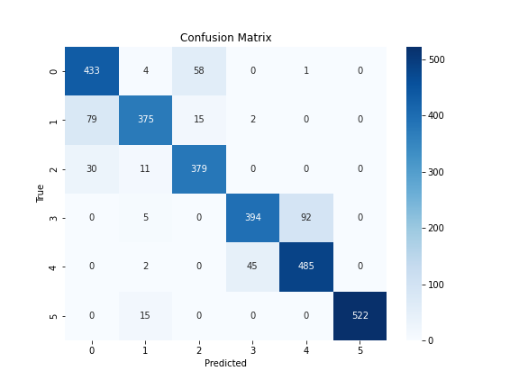
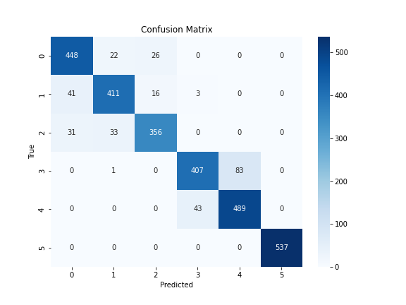
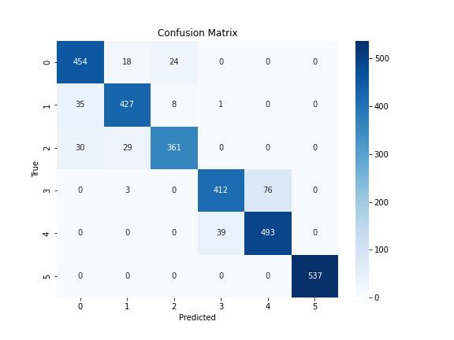

# SensorHAR

# 📄 Human Activity Recognition (HAR) on UCI Dataset

This project implements a machine learning pipeline for classifying human activities from smartphone sensor data using the UCI HAR Dataset.

---

## 🧼 Preprocessing Steps

### ✅ 1. Dataset
- **Source**: [UCI HAR Dataset](https://archive.ics.uci.edu/ml/datasets/human+activity+recognition+using+smartphones)
- **Signals**: Accelerometer and gyroscope data collected at 50Hz
- **Windowing**: 2.56-second windows (128 readings per window), 50% overlap

---

### ✅ 2. Raw Signals Used
From `train/Inertial Signals/*.txt` and `test/Inertial Signals/*.txt`:

| Signal Type   | Axes        |
|---------------|-------------|
| `body_acc`    | x, y, z     |
| `body_gyro`   | x, y, z     |
| `total_acc`   | x, y, z     |

➡️ **Total: 9 signal channels**, each with shape `(7352, 128)` for training.

---

### ✅ 3. Feature Extraction
For each signal window (length 128):

- **Time-domain features (7)**:
  - Mean, Std, Min, Max, Median, Energy, Signal Magnitude Area (SMA)
- **Frequency-domain features (4)**:
  - Mean of FFT, Std of FFT, Dominant frequency bin, Frequency-domain energy

➡️ **11 features per signal × 9 signals = 99 features per sample**

---

### ✅ 4. Normalization
All models (except XGBoost) used standardization:

```python
from sklearn.preprocessing import StandardScaler

scaler = StandardScaler()
X_train_scaled = scaler.fit_transform(X_train)
X_test_scaled = scaler.transform(X_test)
```

---

### ✅ 5. Label Preparation

Original labels from `y_train.txt` and `y_test.txt`:

| Label | Activity             |
|-------|----------------------|
| 1     | WALKING              |
| 2     | WALKING_UPSTAIRS     |
| 3     | WALKING_DOWNSTAIRS   |
| 4     | SITTING              |
| 5     | STANDING             |
| 6     | LAYING               |

For **XGBoost** (which expects 0-based indexing), labels were adjusted as:

```python
y_train_xgb = y_train - 1
y_test_xgb = y_test - 1
```

---

## 🤖 Trained Models

All models were trained using the 99 extracted features:

| Model                  | Notes |
|------------------------|-------|
| ✅ **Random Forest**         | Good baseline. Balanced recall. Some confusion in posture classes. |
| ✅ **SVM (RBF kernel)**      | Struggled on walking-related classes. Sensitive to feature scale. |
| ✅ **Logistic Regression**   | Fast and interpretable. Best on WALKING and STANDING. |
| ✅ **MLP (Neural Network)**  | Balanced accuracy. Good posture separation. |
| ✅ **XGBoost (untuned)**     | High performance out-of-the-box. Strong on WALKING and LAYING. |
| ✅ **XGBoost (tuned)**       | **Best overall performance** after hyperparameter tuning. Fewer walking/stair confusions. |

---

## 📊 Evaluation Highlights

- All models **perfectly classified LAYING**
- Most confusion occurred between:
  - WALKING vs WALKING_UPSTAIRS / DOWNSTAIRS
  - SITTING vs STANDING
- **Tuned XGBoost** achieved the best overall accuracy and class separation

---

## 🧪 Metrics Used

- `classification_report()` for precision, recall, F1-score
- `confusion_matrix()` for detailed class-by-class error analysis

---

## Results

**Logistic Regression**



**Random Forest**


**SVM with RBF kernel**


**MLP**


**XGBoost**



**XGBoost, tuned**




## 🔜 Next Steps

- Add new features: jerk signals, magnitude, orientation angles, axis correlations
- Try ensemble voting of top models (e.g., RF + XGBoost + MLP)
- Visualize feature importance using `xgb.plot_importance()` or SHAP

---

_Developed and documented by Archana using Python, scikit-learn, and XGBoost_
